# Sơ Đồ Kiến Trúc Chuẩn (Phông Màu Đen - Dark Theme): OCR Bóc Tách Hình Ảnh → AI Model Local Suy Luận

Tài liệu này thể hiện đúng mục đích cốt lõi của hệ thống **DCID: Digital Cognitive InDustrial System**: **OCR làm nhiệm vụ bóc tách hình ảnh/bản vẽ kỹ thuật thành thông số, sau đó gửi trực tiếp về AI Model Local (LM Studio / Qwen 1.5B) để thực hiện suy luận chuyên sâu và trả lời câu hỏi cầm tay chỉ việc cho kỹ sư.**  
*(Đã chuẩn hóa phông màu đen tối ưu độ tương phản cao, dễ nhìn cho reviewer).*

---

## 1. Sơ Đồ Khối Cơ Bản (Core Workflow — Nhìn Nhanh 10 Giây)

Sơ đồ thể hiện rõ vai trò trung tâm: **Hình ảnh Bản vẽ $\rightarrow$ Bóc tách qua OCR $\rightarrow$ Gửi thẳng cho AI Model Local suy luận $\rightarrow$ Câu trả lời**:

```mermaid
%%{init: {
  'theme': 'dark',
  'themeVariables': {
    'darkMode': true,
    'background': '#0f172a',
    'primaryColor': '#1e293b',
    'primaryBorderColor': '#38bdf8',
    'primaryTextColor': '#f8fafc',
    'lineColor': '#38bdf8'
  }
}}%%
graph LR
    subgraph Input ["1. Đầu Vào (Nhà Xưởng)"]
        Img["🖼️ Hình Ảnh / Bản Vẽ Kỹ Thuật"]
        Q["❓ Câu Hỏi / Yêu Cầu Của Kỹ Sư"]
    end

    subgraph OCR_Layer ["2. Bóc Tách Hình Ảnh"]
        OCR["👁️ AI OCR: PaddleOCR + PyMuPDF<br/>(Bóc Tách Chữ, Số, Kích Thước, Bbox)"]
    end

    subgraph LLM_Layer ["3. AI Model Local (Suy Luận & Trả Lời)"]
        LLM["🧠 LM Studio: Qwen 1.5B Local<br/>(Suy Luận Kỹ Thuật & Cầm Tay Chỉ Việc)"]
    end

    subgraph Output ["4. Đầu Ra"]
        Ans["💡 Hướng Dẫn Thao Tác Chi Tiết<br/>(Tường Minh + Trích Dẫn Trang)"]
    end

    %% Luồng Cốt Lõi: Bóc Tách Hình Ảnh -> AI Local Suy Luận
    Img -->|"1. Đưa hình ảnh vào bóc tách"| OCR
    OCR ==>|"2. Gửi dữ liệu thông số OCR"| LLM
    Q ==>|"3. Câu hỏi tra cứu"| LLM
    LLM ==>|"4. Trả lời chuyên sâu"| Ans

    %% Luồng Bổ Trợ: Tra Cứu Lịch Sử (Vector Store)
    subgraph Storage ["Tầng Bộ Nhớ Lịch Sử (Bổ Trợ)"]
        EMB["🧬 e5-small Embedding"]
        Chroma["🗄️ ChromaDB Vector Store"]
    end
    OCR -.->|"Lưu trữ lâu dài"| EMB -.-> Chroma
    Chroma -.->|"Tra cứu khi hỏi tài liệu cũ"| LLM
```

---

## 2. Sơ Đồ Tuần Tự Tương Tác Thực Tế (Sequence Diagram — Phông Màu Đen)

Sơ đồ tuần tự được cấu hình với phông nền đen (`#0f172a`), đường nét cyan sáng (`#38bdf8`) cùng vùng highlight tối màu giúp reviewer quan sát cực kỳ sắc nét và dịu mắt:

```mermaid
%%{init: {
  'theme': 'dark',
  'themeVariables': {
    'darkMode': true,
    'background': '#0f172a',
    'actorBkg': '#1e293b',
    'actorBorder': '#38bdf8',
    'actorTextColor': '#f8fafc',
    'signalColor': '#38bdf8',
    'signalTextColor': '#f8fafc',
    'noteBkgColor': '#1e293b',
    'noteTextColor': '#f8fafc',
    'noteBorderColor': '#38bdf8'
  }
}}%%
sequenceDiagram
    autonumber
    actor User as Kỹ Sư / Xưởng
    participant App as Flutter App (:3000)
    participant BE as Spring Boot BE (:8080)
    participant OCR as dcid-ai-ocr (:8001)
    participant LLM as LM Studio (:1234)
    participant DB as ChromaDB (Bộ nhớ bổ trợ)

    Note over User, LLM: LUỒNG CỐT LÕI: BÓC TÁCH HÌNH ẢNH -> AI LOCAL SUY LUẬN TRẢ LỜI
    User->>App: Gửi hình ảnh bản vẽ / tài liệu + Câu hỏi ("Giải thích thông số bản vẽ này")
    App->>BE: Truyền ảnh và câu hỏi
    
    rect rgb(15, 30, 48)
        Note over BE, OCR: BƯỚC 1: BÓC TÁCH HÌNH ẢNH QUA OCR
        BE->>OCR: POST /ocr/extract (Hình ảnh / PDF bản vẽ)
        Note right of OCR: PyMuPDF dựng ảnh RGB 200 DPI<br/>PaddleOCR bóc tách ký tự, số, dung sai
        OCR-->>BE: Trả về văn bản thông số bóc tách (PageOcr Text + Bounding Box)
    end

    rect rgb(35, 28, 15)
        Note over BE, LLM: BƯỚC 2: GỬI DỮ LIỆU OCR VỀ AI MODEL LOCAL ĐỂ SUY LUẬN
        BE->>LLM: Gửi Prompt (Chỉ thị + Dữ liệu OCR bóc tách được + Câu hỏi kỹ sư)
        Note right of LLM: AI Model Local (deepseek-r1-distill-qwen-1.5b)<br/>suy luận ý nghĩa kỹ thuật, chuẩn hóa lỗi OCR rớt dấu
        LLM-->>BE: Trả về câu trả lời suy luận chi tiết kèm các bước thao tác
    end

    BE-->>App: Trả kết quả hướng dẫn cho kỹ sư
    App-->>User: Hiển thị câu trả lời cầm tay chỉ việc ngay trên màn hình

    Note over BE, DB: BƯỚC BỔ TRỢ: LƯU TRỮ VÀO CHROMADB ĐỂ TRA CỨU SAU NÀY
    BE->>DB: Nhúng và lưu vector các đoạn OCR bản vẽ vào ChromaDB để tái sử dụng
```

---

## 3. Bản Chất Của Từng Thành Phần Trong Kiến Trúc

### 👁️ 1. Bóc Tách Hình Ảnh (`dcid-ai-ocr` - PaddleOCR)
- **Mục đích duy nhất**: Biến hình ảnh bản vẽ kỹ thuật, sơ đồ cơ khí, tài liệu SOP (vốn là các điểm ảnh vô tri) thành các con số kỹ thuật, ký hiệu kích thước (`mm`, `VAC`, `RPM`), dung sai và chú thích rõ ràng.
- **Đầu ra**: Văn bản bóc tách từ hình ảnh (`PageOcr`).

### 🧠 2. AI Model Local Suy Luận (`LM Studio` - Qwen 1.5B)
- **Mục đích duy nhất**: Đóng vai trò bộ não suy luận chuyên gia. Nhận dữ liệu thô vừa được OCR bóc tách từ hình ảnh, kết hợp với câu hỏi của người dùng để:
  - Hiểu và phân tích mối liên hệ cơ khí giữa các chi tiết trong bản vẽ.
  - Khôi phục các từ ngữ tiếng Việt bị OCR bóc tách thiếu dấu (ví dụ `c đnh` $\rightarrow$ `cố định`).
  - Đưa ra câu trả lời **cầm tay chỉ việc** từng bước tường minh, chính xác cho kỹ sư tại hiện trường xưởng.

### 🗄️ 3. Bộ Nhớ Lịch Sử (`ChromaDB` + `e5-small`)
- **Mục đích bổ trợ**: Khi xưởng có hàng nghìn bản vẽ đã từng bóc tách qua OCR, ChromaDB lưu giữ các bản bóc tách này. Khi kỹ sư đặt câu hỏi mà không cần chụp lại ảnh, hệ thống tìm lại đúng đoạn thông số OCR cũ và gửi cho AI Model Local suy luận trả lời.
