# Sơ Đồ Kiến Trúc Chuẩn (Phông Màu Đen - Dark Theme): OCR Bóc Tách Hình Ảnh → AI Model Local Suy Luận

Tài liệu này thể hiện đúng mục đích cốt lõi của hệ thống **DCID: Digital Cognitive InDustrial System**: **OCR làm nhiệm vụ bóc tách hình ảnh/bản vẽ kỹ thuật thành thông số, sau đó gửi trực tiếp về AI Model Local (LM Studio / Qwen 1.5B) để thực hiện suy luận chuyên sâu và trả lời câu hỏi cầm tay chỉ việc cho kỹ sư.**  
*(Đã chuẩn hóa phông màu đen tối ưu độ tương phản cao, dễ nhìn cho reviewer).*

---

## 1. Sơ Đồ Khối Cơ Bản (Core Workflow — Nhìn Nhanh 10 Giây)

Sơ đồ thể hiện rõ vai trò trung tâm: **Hình ảnh Bản vẽ $\rightarrow$ Bóc tách qua OCR $\rightarrow$ Gửi thẳng cho AI Model Local suy luận $\rightarrow$ Câu trả lời**:

```mermaid
%%{init: {
  'theme': 'dark',
  'themeVariables': {
    'darkMode': true,
    'background': '#0f172a',
    'primaryColor': '#1e293b',
    'primaryBorderColor': '#38bdf8',
    'primaryTextColor': '#f8fafc',
    'lineColor': '#38bdf8'
  }
}}%%
graph LR
    subgraph Input ["1. Đầu Vào (Nhà Xưởng)"]
        Img["🖼️ Hình Ảnh / Bản Vẽ Kỹ Thuật"]
        Q["❓ Câu Hỏi / Yêu Cầu Của Kỹ Sư"]
    end

    subgraph OCR_Layer ["2. Bóc Tách Hình Ảnh"]
        OCR["👁️ AI OCR: PaddleOCR + PyMuPDF<br/>(Bóc Tách Chữ, Số, Kích Thước, Bbox)"]
    end

    subgraph LLM_Layer ["3. AI Model Local (Suy Luận & Trả Lời)"]
        LLM["🧠 LM Studio: Qwen 1.5B Local<br/>(Suy Luận Kỹ Thuật & Cầm Tay Chỉ Việc)"]
    end

    subgraph Output ["4. Đầu Ra"]
        Ans["💡 Hướng Dẫn Thao Tác Chi Tiết<br/>(Tường Minh + Trích Dẫn Trang)"]
    end

    %% Luồng Cốt Lõi: Bóc Tách Hình Ảnh -> AI Local Suy Luận
    Img -->|"1. Đưa hình ảnh vào bóc tách"| OCR
    OCR ==>|"2. Gửi dữ liệu thông số OCR"| LLM
    Q ==>|"3. Câu hỏi tra cứu"| LLM
    LLM ==>|"4. Trả lời chuyên sâu"| Ans

    %% Luồng Bổ Trợ: Tra Cứu Lịch Sử (Vector Store)
    subgraph Storage ["Tầng Bộ Nhớ Lịch Sử (Bổ Trợ)"]
        EMB["🧬 e5-small Embedding"]
        Chroma["🗄️ ChromaDB Vector Store"]
    end
    OCR -.->|"Lưu trữ lâu dài"| EMB -.-> Chroma
    Chroma -.->|"Tra cứu khi hỏi tài liệu cũ"| LLM
```

---

## 2. Sơ Đồ Tuần Tự Tương Tác Thực Tế (Sequence Diagram — Phông Màu Đen)

Sơ đồ tuần tự được cấu hình với phông nền đen (`#0f172a`), đường nét cyan sáng (`#38bdf8`) cùng vùng highlight tối màu giúp reviewer quan sát cực kỳ sắc nét và dịu mắt:

```mermaid
%%{init: {
  'theme': 'dark',
  'themeVariables': {
    'darkMode': true,
    'background': '#0f172a',
    'actorBkg': '#1e293b',
    'actorBorder': '#38bdf8',
    'actorTextColor': '#f8fafc',
    'signalColor': '#38bdf8',
    'signalTextColor': '#f8fafc',
    'noteBkgColor': '#1e293b',
    'noteTextColor': '#f8fafc',
    'noteBorderColor': '#38bdf8'
  }
}}%%
sequenceDiagram
    autonumber
    actor User as Kỹ Sư / Xưởng
    participant App as Flutter App (:3000)
    participant BE as Spring Boot BE (:8080)
    participant OCR as dcid-ai-ocr (:8001)
    participant LLM as LM Studio (:1234)
    participant DB as ChromaDB (Bộ nhớ bổ trợ)

    Note over User, LLM: LUỒNG CỐT LÕI: BÓC TÁCH HÌNH ẢNH -> AI LOCAL SUY LUẬN TRẢ LỜI
    User->>App: Gửi hình ảnh bản vẽ / tài liệu + Câu hỏi ("Giải thích thông số bản vẽ này")
    App->>BE: Truyền ảnh và câu hỏi
    
    rect rgb(15, 30, 48)
        Note over BE, OCR: BƯỚC 1: BÓC TÁCH HÌNH ẢNH QUA OCR
        BE->>OCR: POST /ocr/extract (Hình ảnh / PDF bản vẽ)
        Note right of OCR: PyMuPDF dựng ảnh RGB 200 DPI<br/>PaddleOCR bóc tách ký tự, số, dung sai
        OCR-->>BE: Trả về văn bản thông số bóc tách (PageOcr Text + Bounding Box)
    end

    rect rgb(35, 28, 15)
        Note over BE, LLM: BƯỚC 2: GỬI DỮ LIỆU OCR VỀ AI MODEL LOCAL ĐỂ SUY LUẬN
        BE->>LLM: Gửi Prompt (Chỉ thị + Dữ liệu OCR bóc tách cấu trúc hóa + Câu hỏi kỹ sư)
        Note right of LLM: AI Model Local (deepseek-r1-distill-qwen-1.5b)<br/>Cấu hình tối ưu: temp=0.2, top_p=0.9, repetition_penalty=1.2<br/>suy luận ý nghĩa kỹ thuật, chuẩn hóa lỗi OCR rớt dấu
        LLM-->>BE: Trả về câu trả lời suy luận chi tiết kèm trích dẫn tọa độ Bbox
    end

    BE-->>App: Trả kết quả hướng dẫn kèm danh sách trích dẫn (versionId, pageNo, bboxKey, snippet)
    App-->>User: Hiển thị câu trả lời và nhãn trích dẫn. Click nhãn mở Hộp thoại Tọa độ Bbox & Nội dung gốc

    Note over BE, DB: BƯỚC BỔ TRỢ: LƯU TRỮ VÀO CHROMADB ĐỂ TRA CỨU SAU NÀY
    BE->>DB: Nhúng và lưu vector các đoạn OCR bản vẽ (kèm metadata bbox & snippet) vào ChromaDB
```

---

## 3. Bản Chất Của Từng Thành Phần Trong Kiến Trúc (Nâng Cấp Không Gian & Cấu Trúc)

### 👁️ 1. Bóc Tách Hình Ảnh & Tọa Độ Không Gian (`dcid-ai-ocr` - PaddleOCR + PyMuPDF)
- **Mục đích duy nhất**: Biến hình ảnh bản vẽ kỹ thuật, sơ đồ cơ khí, tài liệu SOP thành các con số kỹ thuật, ký hiệu kích thước (`mm`, `VAC`, `RPM`), dung sai kèm theo **tọa độ không gian (Bounding Box `[x0, y0, x1, y1]`)** cho từng dòng/khối chữ.
- **Đầu ra**: Văn bản cấu trúc hóa từ hình ảnh kèm danh sách tọa độ (`PageOcr(text, boxes)`).

### 📐 2. Cấu Trúc Hóa Không Gian & Gom Nhóm (`dcid-ai` - `chunk.py` + `index.py`)
- **Mục đích**: Chuyển đổi dữ liệu OCR thô thành định dạng **Markdown logic có cấu trúc** (`### [Bảng/Đoạn kỹ thuật - Trang X | Bbox: minX,minY,maxX,maxY]`).
- Khi chia nhỏ chunk (sliding-window), tính toán tọa độ gộp (`bbox`) và đoạn tóm tắt (`snippet` 300 ký tự) để lưu vào metadata của ChromaDB (`collection kcn_chunks`), phục vụ định vị chính xác khi trích dẫn.

### 🧠 3. AI Model Local Suy Luận (`LM Studio` - Qwen 1.5B)
- **Mục đích duy nhất**: Đóng vai trò bộ não suy luận chuyên gia. Nhận dữ liệu vừa được OCR bóc tách kèm thông tin không gian Bbox để:
  - Hiểu và phân tích mối liên hệ cơ khí/điện giữa các chi tiết trong bản vẽ.
  - Cấu hình suy luận chuẩn theo chuyên ngành: **`temperature=0.2`** (dự đoán ổn định), **`top_p=0.9`**, **`repetition_penalty=1.2`** (ngăn lặp từ tuyệt đối, có cơ chế tự động Retry Fallback nếu backend không nhận extra_body).
  - Khôi phục các từ ngữ tiếng Việt bị OCR bóc tách thiếu dấu (`c đnh` $\rightarrow$ `cố định`).
  - Trích dẫn tường minh tọa độ **`(Trang X | Bbox Y)`** để kỹ sư đối chiếu ngay trên bản vẽ.

### 📱 4. Hiển Thị Trích Dẫn Không Gian Trên App (`Flutter App` - `search_screen.dart`)
- **Mục đích**: Khi kỹ sư nhận câu trả lời, mỗi nguồn tài liệu đi kèm một nhãn trích dẫn.
- Khi nhấp (`InkWell.onTap`) vào nhãn **`Trang X [Bbox]`**, hệ thống hiển thị **Hộp thoại Trích Dẫn Không Gian (`AlertDialog`)** trình bày rõ tọa độ Bbox và đoạn văn bản gốc (`snippet`) được AI tham chiếu.

### 🗄️ 5. Bộ Nhớ Lịch Sử (`ChromaDB` + `e5-small`)
- **Mục đích bổ trợ**: Lưu giữ các bản bóc tách kèm theo metadata `bbox` và `snippet`. Khi tra cứu tài liệu cũ, hệ thống truy xuất các chunk có độ tương đồng cao nhất (`cosine similarity`), gửi thẳng về cho AI Model Local suy luận trả lời.
