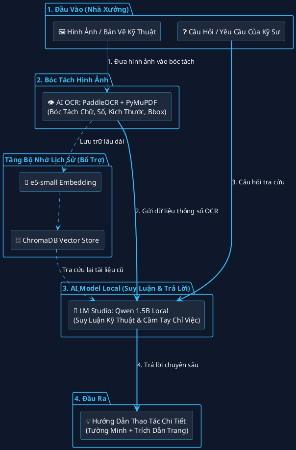
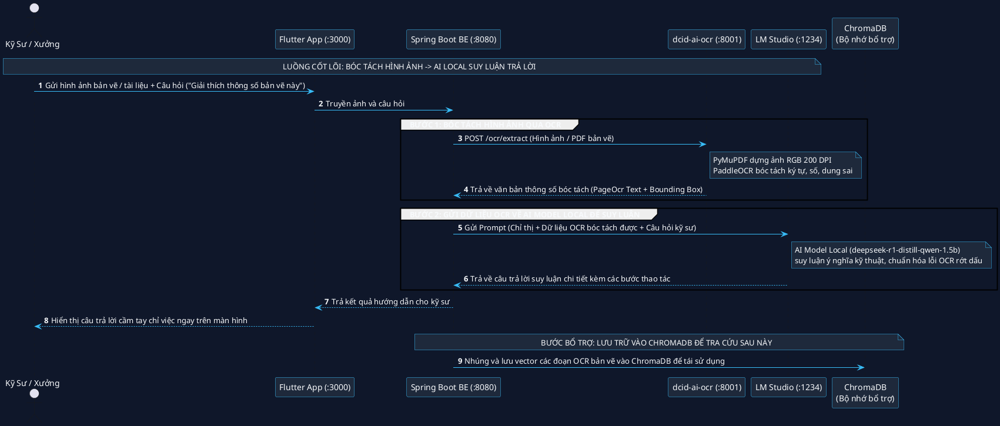

# Sơ Đồ PlantUML (`.puml`) — AI Processing DCID: Digital Cognitive InDustrial System

Dưới đây là toàn bộ mã nguồn chuẩn **PlantUML** cho các sơ đồ luồng xử lý AI của dự án (đã tương thích 100% mọi phiên bản PlantUML, không cần khai báo theme ngoài). Bạn có thể copy trực tiếp vào [PlantText / PlantUML Web](https://www.planttext.com/) hoặc extension PlantUML trong VS Code để vẽ/xuất ảnh `.png`/`.svg`.

---

## 1. Sơ Đồ Khối Cơ Bản (`ai_processing.puml`)

Copy đoạn code bên dưới (hoặc mở file `docs/ai_processing.puml`):

---

## 2. Sơ Đồ Tuần Tự (`ai_sequence.puml`)

Copy đoạn code bên dưới (hoặc mở file `docs/ai_sequence.puml`):

