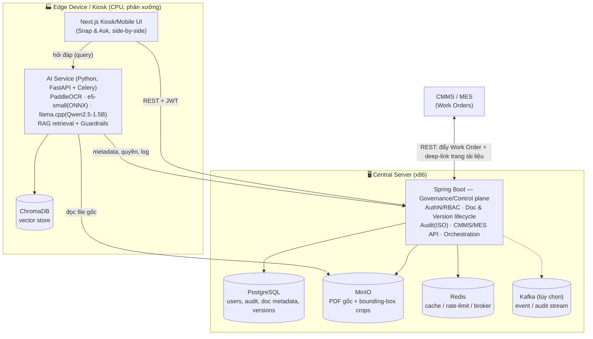
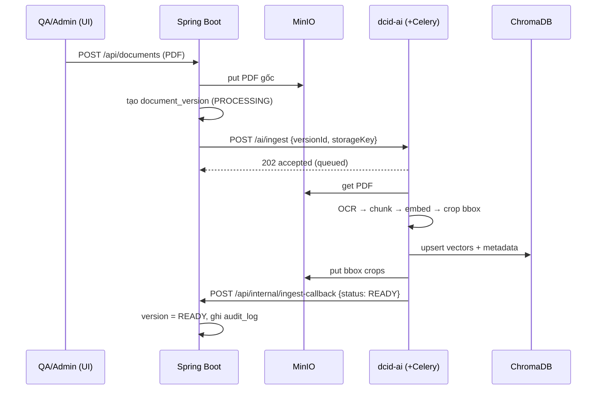
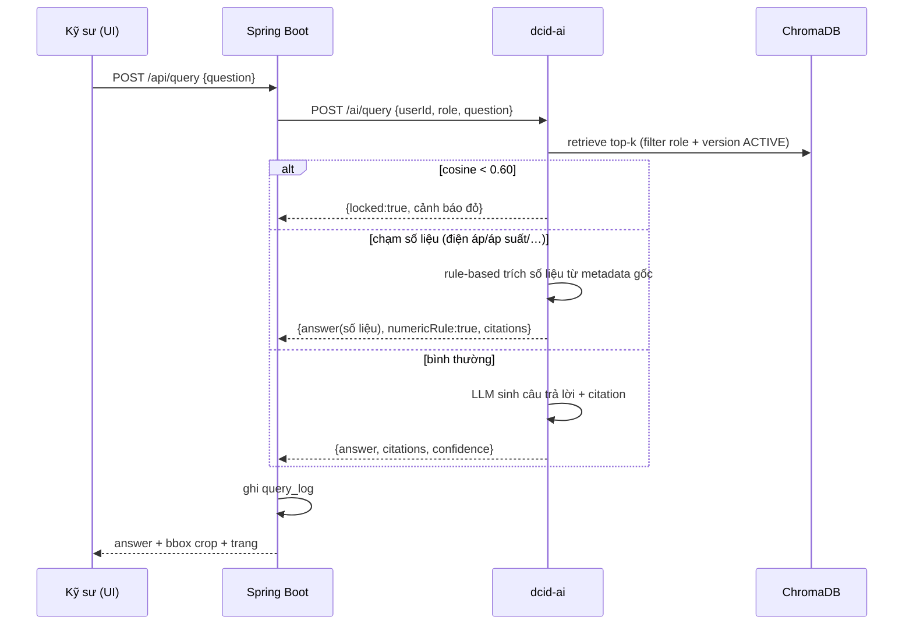

# Smart KCN Docs — Kiến trúc dự án (đề xuất)

> Trợ lý kỹ thuật số & quản trị tri thức **on-premise** cho khu công nghiệp.
> Tài liệu này là bản đề xuất kiến trúc thực tế, bám theo Business Case và **tái sử dụng tối đa**
> hạ tầng Spring Boot sẵn có trong repo.

---

## 1. Nguyên tắc thiết kế (Design principles)

1. **Tách 2 mặt phẳng (two-plane split).** AI inference vốn là Python (PaddleOCR, embeddings ONNX,
   ChromaDB, llama.cpp/GGUF). Spring Boot **không** chạy được các mô hình này. Vì vậy:
   - **Governance/Control plane** → Spring Boot (repo này).
   - **AI plane** → dịch vụ Python (FastAPI + Celery), tách riêng.
   Ranh giới nói chuyện qua **REST nội bộ** (HTTP, cùng mạng LAN nhà máy).
2. **100% on-premise / air-gapped.** Không gọi API cloud thương mại. Auth tự chủ (self-JWT),
   không phụ thuộc IdP ngoài.
3. **Edge-friendly.** LLM/OCR chạy trên CPU tại Edge Device; server trung tâm chỉ giữ
   DB + object storage + vector store + governance.
4. **Zero-tolerance với số liệu.** Guardrail (confidence threshold + rule-based) nằm ở AI plane,
   nhưng **audit và bằng chứng (bounding-box crop)** được lưu và phục vụ bởi Spring Boot.
5. **Không "ốc đảo dữ liệu".** Mọi thứ có API để CMMS/MES tích hợp.

---

## 2. Sơ đồ tổng thể



---

## 3. Thành phần & trách nhiệm

| Thành phần | Công nghệ | Trách nhiệm chính |
|---|---|---|
| **Governance plane** | Spring Boot 3.3, Java 21 | Auth/RBAC, quản lý tài liệu + version, audit ISO, storage MinIO, tích hợp CMMS/MES, điều phối job AI |
| **AI plane** | Python, FastAPI, Celery | OCR (PaddleOCR), embedding (e5-small ONNX), retrieval (ChromaDB), LLM (Qwen2.5-1.5B GGUF qua llama.cpp), guardrails |
| **Vector store** | ChromaDB | Semantic search trên chunk + metadata (trang, ngôn ngữ, version) |
| **Relational DB** | PostgreSQL 16 | users, roles, document/version metadata, query_logs, audit_logs, work_orders |
| **Object storage** | MinIO | PDF gốc, ảnh trang, **bounding-box crop** (bằng chứng số liệu) |
| **Cache/Broker** | Redis 7 | cache, rate-limit, (tùy chọn) Celery broker |
| **Event bus** | Kafka (tùy chọn) | phát sự kiện ingest/audit bất đồng bộ |
| **Frontend** | Next.js (thư mục `dcid-frontend`) | Kiosk/Mobile UI, Snap & Ask, đối chiếu bản vẽ |

**Ranh giới rõ ràng:** AI plane **không** giữ quyền/RBAC/audit gốc — nó gọi Spring Boot để kiểm tra
quyền và ghi log. Spring Boot **không** chạy model — nó gọi AI plane để OCR/embed/query.

---

## 4. Luồng nghiệp vụ chính

### 4.1. Ingestion (số hóa tài liệu)
```
QA/Admin upload PDF (Spring Boot)
  → lưu file gốc vào MinIO, tạo bản ghi Document + DocumentVersion (Postgres, status=PROCESSING)
  → phát job sang AI Service (REST/queue)
      → PaddleOCR bóc tách text + bảng (TSR) + toạ độ (bbox), đa ngôn ngữ EN/CN/JP/VI
      → chunk theo cấu trúc + gắn metadata (page, bbox, lang, version)
      → embed (e5-small ONNX) → upsert vào ChromaDB
      → cắt & lưu bounding-box crops vào MinIO
  → callback báo Spring Boot: status=READY (hoặc FAILED)
  → ghi audit_log
```

### 4.2. Truy vấn + Guardrail (Human-in-the-loop)
```
Kỹ sư hỏi (UI) → AI Service:
  retrieve top-k từ ChromaDB (lọc theo quyền/role + version hiện hành)
  IF cosine_similarity < 0.60  → KHÓA câu trả lời sinh tự động,
                                  trả cảnh báo đỏ "Yêu cầu kỹ sư xác minh từ bản vẽ đính kèm"
  IF query chạm 'điện áp/áp suất/nhiệt độ/dung sai'
                               → trích số liệu trực tiếp từ metadata gốc (rule-based), không để LLM "chế"
  ELSE → LLM sinh câu trả lời kèm trích dẫn (page + bbox crop từ MinIO)
AI Service → Spring Boot: ghi query_log (user, timestamp, query, doc version, confidence, có/không hallucination-guard)
```

### 4.3. Versioning workflow
- Upload version mới → version cũ chuyển `SUPERSEDED`; đánh dấu `OBSOLETE` thủ công (QA/Admin).
- Retrieval **luôn** ưu tiên version `ACTIVE`; version obsolete bị loại khỏi kết quả.

### 4.4. Tích hợp CMMS/MES
- CMMS đẩy **Work Order** qua REST → Spring Boot tạo bản ghi + **deep-link** tới đúng trang tài liệu
  sửa chữa của loại máy đó, trả link truy cập tức thì cho kỹ sư.

---

## 5. Mô hình dữ liệu (định hướng)

**Đã có (baseline `V1__init.sql`):** `users`, `audit_logs`.

**Sẽ thêm (mỗi bảng = 1 Flyway migration mới):**
- `documents` — machine/line, category, ngôn ngữ, trạng thái.
- `document_versions` — version, storage_key (MinIO), status (`PROCESSING/READY/ACTIVE/SUPERSEDED/OBSOLETE`), checksum.
- `document_pages` — trang, ảnh, kích thước (để map bbox).
- `query_logs` — user, query, doc_version, confidence, có kèm answer/citation.
- `work_orders` — id CMMS, machine, document deep-link, trạng thái.

> Vector + chunk sống ở **ChromaDB** (không nhồi vào Postgres); Postgres chỉ giữ metadata quan hệ.

---

## 6. Bảo mật · RBAC · Audit

- **Self-JWT (HS256):** login → token; filter xác thực Bearer, gắn `ROLE_<role>`.
- **RBAC 4 vai** (`UserRole`): `OPERATOR` (chỉ SOP/an toàn), `ENGINEER` (bản vẽ, sơ đồ, log bảo trì),
  `QA_ADMIN` (upload, obsolete, duyệt version), `ADMIN` (quản trị hệ thống).
  Áp bằng `@PreAuthorize("hasRole('...')")` (method security đã bật).
- **Audit ISO:** `AuditLog` (actor, action, resource, timestamp, ip, detail JSONB) — bất biến, phục vụ truy vết.

---

## 7. Topology triển khai

- **Central Server (1 máy x86 phổ thông):** Postgres + MinIO + Redis + (Kafka) + Spring Boot.
- **Edge Device (Mini/Industrial PC, Core i5/RAM 8GB):** Next.js UI + AI Service + ChromaDB cục bộ.
  → LLM/OCR chạy cục bộ, không cần GPU server; dữ liệu nhạy cảm không rời nhà máy.
- Nhiều Edge có thể chia sẻ 1 Central; hoặc chạy full-stack trên 1 Edge cho pilot.

---

## 8. Ranh giới Spring Boot ↔ AI service (contract — *chưa code, sẽ làm sau*)

Khi bắt đầu tích hợp, đề xuất một interface `AiPipelineClient` trong Spring Boot với hợp đồng REST:

| Method | Endpoint (AI service) | Ý nghĩa |
|---|---|---|
| `ingest(versionId, storageKey, langs)` | `POST /ai/ingest` | kích hoạt OCR→chunk→embed→index |
| `query(userId, role, question, filters)` | `POST /ai/query` | RAG + guardrail, trả answer + citations + confidence |
| `health()` | `GET /ai/health` | readiness của model |

Callback AI → Spring Boot: `POST /api/internal/ingest-callback` (bảo vệ bằng token nội bộ).

> Quyết định thiết kế hiện tại: **chưa dựng** interface/stub này — xem §9 roadmap.

---

## 9. Roadmap ánh xạ với repo & Business Case

| Phase (BC) | Việc | Trạng thái trong repo |
|---|---|---|
| — | Reset skeleton + self-JWT + RBAC + audit | ✅ **Đã xong** (lần format này) |
| P1–P2 | AI Core & OCR & RAG (Python) | ⬜ Repo riêng / service Python |
| P3 | Backend Governance: Document/Version/Query/WorkOrder + Admin | ⬜ Thêm domain vào Spring Boot (theo §5) |
| P3 | `AiPipelineClient` + ingest callback | ⬜ Theo §8 |
| P4 | Kiosk/Mobile UI (Snap & Ask, side-by-side) | 🟡 `dcid-frontend` (Next.js) — cần chỉnh |
| P5 | Pilot & UAT 01 dây chuyền | ⬜ |

---

## 10. Đã thực hiện trong lần "format" này

- Xóa toàn bộ domain e-government cũ (citizen/officer: Application, Procedure, Appointment,
  Notification, CitizenProfile, OfficerProfile...), migrations V1–V6, messaging & websocket domain.
- Thay **Keycloak/OAuth2** → **self-issued JWT + RBAC nội bộ** (login/me hoạt động thật, seed admin).
- Giữ lại hạ tầng tái dùng: config, common, exception, security, filter, MinIO, Redis, Kafka, audit,
  OpenAPI, global exception handling.
- Baseline schema mới `V1__init.sql` (users + audit_logs). `.gitignore` + gỡ `target/` khỏi git.
- Build xanh: `./mvnw -DskipTests test-compile` + unit test health.

Chi tiết vận hành backend: xem `dcid-backend/CLAUDE.md`.

---
---

# Phần B — Kiến trúc chi tiết (Complete Architecture)

> Quyết định đã chốt: **monorepo** (AI ở `dcid-ai/`) · **VI+EN trước** (CN/JP ở M2) ·
> **llama-cpp-python** cho LLM serving.

## B1. Cấu trúc thư mục toàn dự án

```
dcid-web/                      (monorepo)
├── dcid-backend/              Spring Boot — governance/control plane
│   └── src/main/java/vn/dcid/ {api, service, repository, domain, security, config, ...}
├── dcid-frontend/             Next.js — Web console + Kiosk UI
├── dcid-mobile/               Flutter — app hiện trường (Snap & Ask)   ← TẠO Ở M2–M4
├── dcid-ai/                   Python (FastAPI + Celery) — AI plane   ← TẠO Ở M1
├── docs/                      ARCHITECTURE.md, ROADMAP.md, FRONTEND.md
└── docker-compose.yml         postgres · redis · minio · kafka · backend (+ ai, chroma ở M1)
```

## B2. Kiến trúc nội bộ `dcid-ai` (Python)

```
dcid-ai/
├── app/
│   ├── main.py               # FastAPI app + router
│   ├── config.py             # pydantic-settings (env)
│   ├── api/
│   │   ├── health.py         # GET  /ai/health
│   │   ├── ingest.py         # POST /ai/ingest   → enqueue Celery task
│   │   └── query.py          # POST /ai/query    → RAG + guardrails (đồng bộ)
│   ├── pipeline/
│   │   ├── ocr.py            # PaddleOCR (multi-lang, TSR bảng biểu)
│   │   ├── chunk.py          # structure-aware chunking (giữ cấu trúc bảng)
│   │   ├── embed.py          # multilingual-e5-small (ONNX qua optimum)
│   │   ├── index.py          # ChromaDB upsert
│   │   ├── retrieve.py       # top-k + filter (role, version=ACTIVE)
│   │   └── bbox.py           # cắt bounding-box crop → MinIO
│   ├── llm/
│   │   ├── engine.py         # llama-cpp-python (Qwen2.5-1.5B Q4_K_M)
│   │   └── prompt.py         # system prompt + format trích dẫn
│   ├── guardrails/
│   │   ├── confidence.py     # cosine < 0.60 → khóa câu trả lời
│   │   └── numeric.py        # rule-based trích số liệu (điện áp/áp suất/…)
│   ├── clients/
│   │   ├── minio_client.py   # đọc PDF gốc / ghi crop
│   │   └── backend_client.py # callback → dcid-backend (token nội bộ)
│   └── tasks.py              # Celery: ingest bất đồng bộ
├── models/                   # GGUF + ONNX weights (đóng gói offline)
├── tests/
├── pyproject.toml
└── Dockerfile
```

**Vì sao đồng bộ cho `query`, bất đồng bộ cho `ingest`:** hỏi–đáp cần trả ngay (<5s); còn OCR+embed
một tài liệu nhiều trang là việc nặng → đẩy vào Celery worker, báo kết quả qua callback.

## B3. Mô hình dữ liệu quan hệ (chi tiết — PostgreSQL)

Đã có: `users`, `audit_logs` (baseline `V1__init.sql`). Domain thêm ở M1–M3:

**`documents`** — 1 tài liệu logic của 1 máy/loại thiết bị
| cột | kiểu | ghi chú |
|---|---|---|
| id | UUID PK | |
| title | varchar | |
| machine_code | varchar | mã máy/chuyền (khớp CMMS) |
| category | varchar | SOP / bản vẽ / sơ đồ mạch / nhật ký |
| min_role | varchar | vai tối thiểu được xem (OPERATOR/ENGINEER/…) |
| created_at/by, updated_at | | audit |

**`document_versions`** — mỗi lần upload = 1 version
| cột | kiểu | ghi chú |
|---|---|---|
| id | UUID PK | |
| document_id | UUID FK | |
| version_no | int | |
| storage_key | varchar | key PDF gốc trong MinIO |
| status | varchar | PROCESSING/READY/ACTIVE/SUPERSEDED/OBSOLETE |
| lang | varchar | vi,en,… |
| checksum | varchar | chống trùng |
| page_count | int | |

**`document_pages`** — map trang ↔ ảnh (để vẽ bbox)
| id, version_id FK, page_no, image_key (MinIO), width, height |

**`query_logs`** — nhật ký hỏi–đáp (ISO + đo hallucination)
| id, actor_id, question, matched_version_id, confidence(float), numeric_rule_hit(bool), locked(bool), created_at |

**`work_orders`** — lệnh từ CMMS/MES
| id, cmms_ref, machine_code, document_version_id FK, deep_link, status, created_at |

> Vector + chunk **không** ở Postgres — sống trong **ChromaDB** (collection theo tài liệu, metadata:
> version_id, page_no, bbox_key, lang, min_role).

## B4. Toàn bộ REST API surface

**Public / JWT (dcid-backend):**
| Method | Path | Vai | Mục đích |
|---|---|---|---|
| POST | `/api/auth/login` | public | lấy JWT |
| GET | `/api/auth/me` | any | hồ sơ hiện tại |
| GET | `/api/health` | public | health |
| POST | `/api/documents` | QA_ADMIN | tạo tài liệu + upload version đầu |
| POST | `/api/documents/{id}/versions` | QA_ADMIN | upload version mới |
| POST | `/api/documents/{versionId}/obsolete` | QA_ADMIN | đánh dấu obsolete |
| GET | `/api/documents` | any (lọc theo role) | danh sách/tra cứu |
| POST | `/api/query` | OPERATOR+ | hỏi–đáp (forward AI, ghi query_log) |
| POST | `/api/integration/work-orders` | (token CMMS) | nhận Work Order |
| GET | `/api/admin/audit-logs` | ADMIN | xem audit |

**Nội bộ Backend ↔ AI (token nội bộ, không ra ngoài LAN):**
| Hướng | Endpoint | Payload |
|---|---|---|
| BE→AI | `POST /ai/ingest` | `{versionId, storageKey, langs}` |
| BE→AI | `POST /ai/query` | `{userId, role, question, filters:{machineCode?}}` |
| AI→BE | `POST /api/internal/ingest-callback` | `{versionId, status, pageCount, error?}` |
| — | `GET /ai/health` | readiness model |

`POST /ai/query` → response:
```json
{ "answer": "…", "confidence": 0.83,
  "citations": [{"versionId":"…","pageNo":12,"bboxKey":"crops/…png"}],
  "guard": { "locked": false, "numericRule": true } }
```

## B5. Sequence diagrams

**Ingest (bất đồng bộ):**


**Query + Guardrail (đồng bộ):**


## B6. Model & tài nguyên Edge

| Thành phần | Định dạng | ~Dung lượng | ~RAM khi chạy |
|---|---|---|---|
| Qwen2.5-1.5B-Instruct | GGUF Q4_K_M | ~1.1 GB | ~2–3 GB |
| multilingual-e5-small | ONNX | <400 MB | vài trăm MB |
| PaddleOCR mobile (multi-lang) | — | vài trăm MB | ~1 GB khi OCR |
| ChromaDB | persistent dir | theo dữ liệu | thấp |

**Yêu cầu Edge tối thiểu:** CPU Core i5, **RAM 8 GB**, SSD. Không cần GPU. Đạt latency <5s/truy vấn
là **mục tiêu cần đo sớm ở M1** (rủi ro #2 trong ROADMAP).

## B7. Triển khai & đóng gói offline cho Edge

- **Không internet lúc chạy:** models (GGUF/ONNX/PaddleOCR) đóng vào image `dcid-ai` hoặc volume
  `models/`; không tải runtime.
- **Đóng gói:** `docker save` các image (backend, ai, postgres, redis, minio, chroma) → chuyển USB/registry nội bộ.
- **Persistence Edge:** volume cho Postgres, MinIO, ChromaDB (survive restart).
- **2 kiểu deploy pilot (còn mở):** (a) full-stack trên 1 Edge; (b) Central (PG+MinIO+BE) + Edge (AI+Chroma+UI).

## B8. Cấu hình · Secrets · Observability · Backup

- **Secrets:** `APP_JWT_SECRET` (≥32B), DB creds, MinIO keys, **token nội bộ BE↔AI** — qua env/`.env`
  (đã có trong `.gitignore`), không hardcode.
- **Observability:** backend đã expose Prometheus (`/actuator/prometheus`) + JSON logs (traceId).
  `dcid-ai` bổ sung `/metrics` + log latency từng stage (ocr/embed/retrieve/llm).
- **Audit ISO:** mọi hành động ghi `audit_logs`; mọi truy vấn ghi `query_logs` (phục vụ KPI hallucination = 0%).
- **Backup:** `pg_dump` định kỳ · mirror MinIO · snapshot thư mục ChromaDB.

## B9. Non-functional & KPI gate (điều kiện nghiệm thu)

| KPI (Business Case §5) | Ngưỡng | Đo bằng |
|---|---|---|
| OCR đa ngôn ngữ | ≥ 95% | golden set 500 trang thực tế |
| Recall@3 | ≥ 92% | bộ câu hỏi eval, kiểm top-3 |
| Latency | < 5 s/truy vấn | đo trên Edge Core i5 |
| Hallucination số liệu | 0% | hậu kiểm `query_logs` (zero-tolerance) |

> Các KPI này là **cổng nghiệm thu M5 (Pilot/UAT)**; harness đo (golden set + eval set) phải sẵn từ **M1**.
