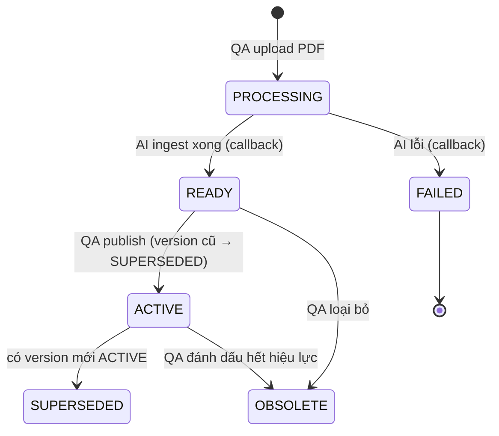

# DCID: Digital Cognitive InDustrial System — ERD & Database

> Schema quan hệ (PostgreSQL) cho `dcid-backend`. Vector/chunk sống ở **Qdrant**, file ở **MinIO**;
> Postgres chỉ giữ **metadata + audit**. Xem kiến trúc: [`ARCHITECTURE.md`](ARCHITECTURE.md) §B3.

---

## 1. Phân tách lưu trữ (rất quan trọng)

| Dữ liệu | Nơi lưu | Ghi chú |
|---|---|---|
| users, documents, versions, pages, query_logs, work_orders, audit_logs | **PostgreSQL** | quan hệ, giao dịch, RBAC, audit |
| vector embedding + chunk text + metadata (version_id, page, bbox_key, lang) | **Qdrant** | semantic search |
| PDF gốc, ảnh trang, bounding-box crop | **MinIO** | tham chiếu bằng `storage_key` / `image_key` / `bbox_key` |

**Nguyên tắc single-writer:** chỉ **backend** ghi Postgres. `dcid-ai` đọc MinIO, ghi Qdrant + MinIO,
rồi **gọi callback** để backend persist `document_pages` + cập nhật `status`. AI **không** nối thẳng Postgres.

---

## 2. Sơ đồ ERD

```mermaid
erDiagram
    users ||--o{ documents          : "created_by"
    users ||--o{ query_logs         : "actor"
    documents ||--o{ document_versions : "has"
    document_versions ||--o{ document_pages : "has"
    document_versions ||--o{ query_logs    : "matched"
    document_versions ||--o{ work_orders   : "deep-link"

    users {
        uuid    id PK
        varchar username UK
        varchar password_hash
        varchar role "OPERATOR|ENGINEER|QA_ADMIN|ADMIN"
        boolean is_active
    }
    documents {
        uuid    id PK
        varchar title
        varchar machine_code
        varchar category "SOP|DRAWING|CIRCUIT|..."
        varchar min_role "vai tối thiểu được xem"
        uuid    created_by
    }
    document_versions {
        uuid    id PK
        uuid    document_id FK
        int     version_no
        varchar storage_key "MinIO: PDF gốc"
        varchar status "PROCESSING|READY|ACTIVE|SUPERSEDED|OBSOLETE|FAILED"
        varchar lang
        int     page_count
        timestamptz ingested_at
    }
    document_pages {
        uuid    id PK
        uuid    version_id FK
        int     page_no
        varchar image_key "MinIO: ảnh trang"
        int     width
        int     height
    }
    query_logs {
        uuid    id PK
        uuid    actor_id FK
        text    question
        uuid    matched_version_id FK
        numeric confidence
        boolean numeric_rule_hit
        boolean locked
        int     latency_ms
    }
    work_orders {
        uuid    id PK
        varchar cmms_ref UK
        uuid    document_version_id FK
        varchar deep_link
        varchar status
    }
    audit_logs {
        uuid    id PK
        uuid    actor_id
        varchar action
        varchar resource_type
        uuid    resource_id
        jsonb   detail
    }
```



> `audit_logs` đứng độc lập (ghi `actor_id`/`resource_id` không FK) để log được cả hành động trên
> mọi loại resource mà không ràng buộc cứng.

---

## 3. Bảng & mục đích (chi tiết cột xem trong migration)

| Bảng | Mục đích | Điểm thiết kế |
|---|---|---|
| **users** | tài khoản + RBAC (đã có, V1) | self-JWT, BCrypt |
| **audit_logs** | vết ISO cho mọi hành động (đã có, V1) | `detail` JSONB |
| **documents** | 1 tài liệu logic của 1 máy/loại | `min_role` để lọc theo quyền; `category` phân loại |
| **document_versions** | mỗi lần upload = 1 version | `status` state machine; **unique 1 ACTIVE/tài liệu** |
| **document_pages** | map trang ↔ ảnh | `width/height` để chuẩn hoá toạ độ bbox |
| **query_logs** | nhật ký hỏi–đáp | `confidence`, `locked`, `numeric_rule_hit`, `latency_ms` → KPI |
| **work_orders** | CMMS/MES (sẵn sàng, dùng sau) | `deep_link` tới đúng trang |

---

## 4. Vòng đời version (state machine `status`)



- **Retrieval chỉ trả `ACTIVE`** (loại SUPERSEDED/OBSOLETE khỏi kết quả).
- Ràng buộc DB `uq_document_versions_active` đảm bảo tối đa 1 ACTIVE / tài liệu.

---

## 5. Cách một câu trả lời truy ngược về bằng chứng (citation)

```
/api/query → AI trả citations[{ versionId, pageNo, bboxKey, snippet }]
   versionId  → document_versions   (tài liệu nào, version nào)
   pageNo     → document_pages       (ảnh trang: image_key + width/height)
   bboxKey    → Tọa độ không gian    (định dạng p{pageNo}_[minX,minY,maxX,maxY] khoanh đỏ vùng dữ liệu)
   snippet    → Đoạn trích dẫn       (đoạn văn bản gốc cấu trúc hóa Markdown tối đa 300 ký tự)
```
FE hiển thị nhãn trích dẫn `Trang X [Bbox]`, click vào để mở Hộp thoại Trích Dẫn Không Gian hiển thị trực tiếp tọa độ Bbox và đoạn văn bản gốc (`snippet`). `query_logs` lưu lại `matched_version_id` + `confidence` + `locked` để hậu kiểm.

---

## 6. Migration đã thêm

| File | Nội dung |
|---|---|
| `V1__init.sql` *(đã có)* | `users`, `audit_logs`, hàm `update_updated_at_column()` |
| **`V2__documents.sql`** | `documents`, `document_versions`, `document_pages` (+ trigger, unique ACTIVE) |
| **`V3__query_logs.sql`** | `query_logs` |
| **`V4__work_orders.sql`** | `work_orders` (CMMS, dùng sau) |

Áp dụng: Flyway tự chạy khi khởi động backend —
`docker-compose up -d postgres && ./mvnw spring-boot:run -Dspring-boot.run.profiles=dev`.
`ddl-auto=validate` không phàn nàn về bảng chưa có entity; entity sẽ thêm ở bước sau.

---

## 7. Quyết định thiết kế

- **Chunk/vector ở Qdrant**, không nhồi Postgres → tránh trùng lặp, tách rõ trách nhiệm.
- **Single-writer Postgres = backend** → AI gửi page metadata qua callback, backend persist.
- **`status` ở version, không ở document** → 1 tài liệu "còn hiệu lực" nếu có version ACTIVE.
- **`min_role` trên document** → lọc RBAC ở tầng dữ liệu (Operator không thấy bản vẽ).
- **VARCHAR + CHECK thay vì Postgres ENUM** → khớp entity JPA (`@Enumerated(STRING)`), dễ mở rộng.
- **`query_logs` là bảng riêng** (không dùng `audit_logs`) → có cột đo KPI chuyên biệt.

---

## 8. Đề xuất bước tiếp theo (sau ERD/DB)

1. **BE — JPA entities + repositories** cho `documents`, `document_versions`, `document_pages`,
   `query_logs` (khớp schema; entity `WorkOrder` để sau). → mở khoá `ddl-auto=validate`.
2. **BE — DTO + endpoint tối thiểu**: `POST /api/documents` (upload → MinIO → tạo version PROCESSING),
   `GET /api/documents`.
3. **BE — `AiPipelineClient` + `POST /api/internal/ingest-callback`** (khung, chưa nối AI thật).
4. **AI — khung `dcid-ai`** (FastAPI `/ai/health` `/ai/ingest` `/ai/query`) song song.

> Gợi ý làm tiếp ngay: **bước 1 (entities + repositories)** vì DB vừa xong và nó nằm gọn trong backend.
