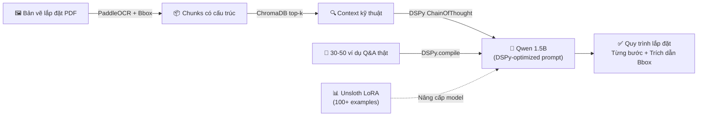

# Đề Xuất Công Nghệ: Training/Tuning Model cho Tình Huống Lắp Đặt từ Bản Vẽ Máy Móc

## 1. Bức Tranh Hiện Trạng Dự Án

### Stack AI hiện tại (dcid-ai)
| Tầng | Công nghệ | Vai trò |
|---|---|---|
| **OCR** | PaddleOCR v3.7 + PyMuPDF | Bóc tách chữ, số, Bbox từ PDF/ảnh bản vẽ |
| **Chunking** | Layout-aware (blank-line + table detection) | Tách đoạn theo cấu trúc không gian |
| **Embedding** | `intfloat/multilingual-e5-small` (384 dim) | Vector hóa passage & query |
| **Vector Store** | ChromaDB (cosine HNSW) | Lưu và tìm kiếm top-k chunk |
| **LLM** | DeepSeek-R1-Distill-Qwen 1.5B (qua LM Studio) | Suy luận & sinh câu trả lời |
| **Guardrail** | Cosine threshold 0.60 + Numeric/Reasoning pattern regex | Lọc câu hỏi ngoài phạm vi |

### Khoảng trống hiện tại (gap analysis)
- ❌ Model LLM là **general-purpose**, không biết quy trình lắp đặt máy móc công nghiệp (SOP, BOM, sequence lắp ráp)
- ❌ Embedding `multilingual-e5-small` chưa được fine-tune trên domain **kỹ thuật cơ khí/điện/bản vẽ**
- ❌ Khi người dùng hỏi "lắp đặt bước mấy trước?", model suy đoán sai thứ tự vì không có cấu trúc quy trình
- ❌ OCR tiếng Việt CER ~10% — lỗi dấu còn cao

---

## 2. Công Nghệ Đề Xuất: **DSPy + Supervised Fine-Tuning (SFT) với Unsloth**

### 🎯 Vì sao chọn hai công nghệ này kết hợp?

Tình huống **"lắp đặt từ bản vẽ máy móc"** có 3 đặc điểm riêng biệt:
1. **Quy trình có thứ tự nghiêm ngặt** — bước 1 phải trước bước 2 (lắp đế → lắp trục → xiết bu-lông)
2. **Số liệu kỹ thuật chính xác tuyệt đối** — moment xiết 45 N·m, áp suất 6.5 bar
3. **Câu hỏi dạng "làm gì tiếp theo?"** — LLM cần biết context quy trình, không chỉ truy xuất text

---

## 3. Công Nghệ 1: **DSPy** (Declarative Self-improving Prompts)

### Là gì?
DSPy là framework tối ưu hóa **prompt + few-shot examples** tự động cho LLM local (DeepSeek/Qwen), thay vì viết prompt thủ công.

### Lý do phù hợp với dự án
- **Không cần GPU đắt tiền** — DSPy tối ưu prompt bằng chính LM Studio local (1.5B) đang có
- **Tối ưu trực tiếp cho tình huống lắp đặt** — học từ các ví dụ Q&A kỹ thuật thật của dự án
- **Thay thế `prompts.py` thủ công** bằng pipeline prompt được tối ưu tự động theo metric

### Cơ chế hoạt động trong dự án
```
[Bản vẽ lắp đặt PDF]
        ↓ OCR (PaddleOCR)
[Chunks kỹ thuật có Bbox]
        ↓ ChromaDB retrieve top-k
[DSPy ChainOfThought Module]  ← ĐÂY là điểm chèn DSPy
   - Tự động tạo reasoning chain từng bước lắp đặt
   - Tự tối ưu few-shot examples từ feedback người dùng
   - Metric: correctness (số liệu đúng) + sequence_order (thứ tự bước đúng)
        ↓
[Câu trả lời cầm tay chỉ việc: "Bước 1: ... Bước 2: ..."]
```

### Ví dụ code tích hợp vào `dcid-ai`
```python
# app/pipeline/dspy_rag.py (MỚI)
import dspy

class InstallationRAG(dspy.Module):
    """RAG pipeline chuyên cho quy trình lắp đặt từ bản vẽ."""
    
    def __init__(self):
        self.retrieve = ChromaDBRetriever()  # wrap index.search()
        self.generate = dspy.ChainOfThought(
            "context, question -> installation_steps, cited_bbox"
        )
    
    def forward(self, question: str, version_ids: list):
        context = self.retrieve(question, version_ids, top_k=7)
        return self.generate(context=context, question=question)

# Tối ưu tự động với 20-50 ví dụ Q&A kỹ thuật thật
optimizer = dspy.BootstrapFewShotWithRandomSearch(metric=installation_accuracy)
optimized_rag = optimizer.compile(InstallationRAG(), trainset=training_examples)
```

### Chi phí & thời gian
- **Cài đặt**: `pip install dspy-ai` (~30 phút setup)
- **Training**: chạy trên CPU với LM Studio local, cần ~20-50 ví dụ Q&A kỹ thuật thật
- **Không cần GPU** — tối ưu prompt, không fine-tune weights

---

## 4. Công Nghệ 2: **Unsloth + LoRA Fine-Tuning** (Tùy chọn nâng cao)

### Là gì?
Unsloth là framework fine-tune LLM (Qwen, DeepSeek) với **LoRA** — nhanh hơn 2x, dùng ít VRAM hơn 80% so với HuggingFace PEFT thông thường.

### Khi nào cần dùng?
Khi DSPy chưa đủ — model vẫn sai quy trình, sai số liệu — cần fine-tune weight thật sự.

### Dataset cần xây dựng
```jsonl
// training_data/installation_qa.jsonl
{"instruction": "Từ bản vẽ [Bbox: 120,340,580,620] trang 3, liệt kê các bước lắp trục chính theo thứ tự.",
 "input": "### [Bảng kỹ thuật - Trang 3 | Bbox: 120.0,340.0,580.0,620.0]\nBước 1: Làm sạch bề mặt trục...",
 "output": "Bước 1: Làm sạch bề mặt trục bằng cồn công nghiệp (Trang 3 | Bbox 120,340)...\nBước 2: Tra mỡ bôi trơn loại SKF LGEP 2 vào rãnh then..."}
```

### Quy trình fine-tune
```bash
# Chạy trên Google Colab Free (T4 16GB) — KHÔNG cần GPU local
pip install unsloth
# Fine-tune Qwen 1.5B → Qwen 1.5B-Installation-Expert
# Xuất GGUF → load lại trong LM Studio
```

### Kết quả kỳ vọng
| Trước SFT | Sau SFT |
|---|---|
| Trả lời chung chung, sai thứ tự | Trả lời theo đúng thứ tự quy trình trong bản vẽ |
| Bịa số liệu (hallucination) | Chỉ trích xuất số liệu có trong Bbox |
| Không biết thuật ngữ cơ khí VN | Hiểu "moment xoắn", "độ côn", "dung sai IT6" |

---

## 5. Lộ Trình Tích Hợp Vào Dự Án

### Ưu tiên 1 (Ngắn hạn — 1-2 tuần): DSPy
```
1. pip install dspy-ai>=2.5
2. Tạo app/pipeline/dspy_rag.py
3. Thu thập 30-50 cặp Q&A thật (từ kỹ sư thực tế)
4. Chạy DSPy.compile() trên LM Studio local
5. Thay thế build_system_prompt() trong prompts.py bằng DSPy-optimized prompt
6. A/B test: so sánh câu trả lời trước/sau DSPy
```

### Ưu tiên 2 (Trung hạn — 3-4 tuần): Unsloth SFT
```
1. Xây dataset JSONL từ 100-500 bản vẽ thật (lắp đặt)
2. Fine-tune Qwen 1.5B trên Google Colab
3. Xuất GGUF (Q8_0 hoặc Q4_K_M)
4. Load vào LM Studio thay thế model gốc
5. Đo CER, accuracy, quy trình order correctness
```

---

## 6. Tại Sao KHÔNG Chọn Các Phương Án Khác?

| Phương án | Vấn đề |
|---|---|
| **RAG thuần túy (đang làm)** | Không có "memory" về thứ tự quy trình; semantic search không phân biệt "bước trước/sau" |
| **Fine-tune toàn bộ model (Full SFT)** | Cần GPU A100/H100, chi phí cực cao, không khả thi cho dự án nhỏ |
| **GPT-4/Claude API** | Bản vẽ máy móc là tài liệu nội bộ, KHÔNG được gửi ra ngoài — vi phạm bảo mật KCN |
| **Chỉ cải thiện prompt (manual)** | Không scale, không tự cải thiện theo feedback người dùng |

---

## 7. Tóm Tắt Khuyến Nghị

> **Áp dụng DSPy ngay** để tối ưu pipeline lắp đặt mà không cần thay đổi hạ tầng, không cần GPU.  
> **Chuẩn bị dataset Unsloth** song song để fine-tune model chuyên dụng khi có đủ 100+ ví dụ thật.


